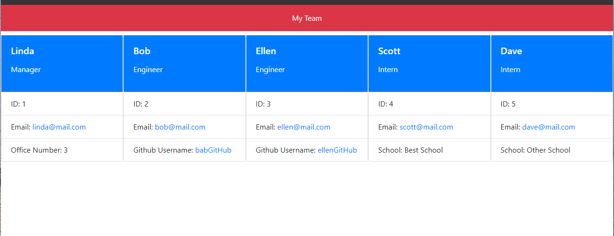

# team-profile-generator
npm run test to run a test

# Team Profile Generator

### Description
_____________________________
This application is a great way to organize and manage your team at work!  There are three types of employees which have shared and unique identifiers to assist with your managing needs.

The output of this application is an HTML file which can be opened in your browser for easy viewing!

### Table of Contents
_____________________________
* [Installation](#installation)
* [Usage](#usage)
* [Tests](#tests)
* [Questions](#questions)

### Installation
_____________________________
*Steps required to install and run this program:*

As there is no front end to this application, you will need to clone this repo and execute the code locally.

Click on the [link](https://github.com/RaeStichter/team-profile-generator) here to access the repo!

### Usage
_____________________________
*Instructions and example for use:*

This video illustrates how to use the application.  Once you navigate to the root directory, all you need to type is `node index.js`. 

This is an example of an output HTML file:

### Tests
_____________________________
*Instructions and example for test cases:*

This video illustrates how to test the classes of the application.  Once you navigate to the __test__ directory, all you need to type is `npm run test`.

### Questions
_____________________________

  Please click on the link provided to access the author's [Github](http://github.com/RaeStichter).
  